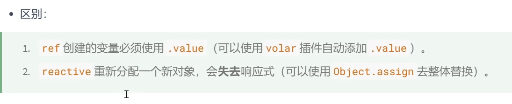

ref用来定义：基本类型、对象类型
active用来定义： 对象类型

区别： 如图

let obj = reactive({
  name: '小红'
})

<!-- 错误，无法直接修改 -->
obj = {name: '小明'}

<!-- 正确写法 -->
Object.assign(obj, {name: '小明'})

computed() 计算属性的结果会有缓存并且只读不可再其他地方修改，但方法不会，用多少次就调用多少次

但用get、和set则可修改，反向给内属性赋值